<div align="center">

<h2>HybridSim: A Physics-Learning Hybrid Digital Twin for mmWave Human Sensing</h2>

<p>
Weitao Xiong<sup>1,2</sup> &nbsp;&nbsp;
Tianyu Liu<sup>2</sup> &nbsp;&nbsp;
Peng Li<sup>2</sup> &nbsp;&nbsp;
Kok Chung Chua<sup>1</sup><br>
Toa Chean Khim<sup>1</sup> &nbsp;&nbsp;
Pu Wang<sup>3</sup> &nbsp;&nbsp;
Hongfei Xue<sup>3†</sup>
</p>

<p>
<sup>1</sup>Xiamen University Malaysia<br>
<sup>2</sup>The Hong Kong University of Science and Technology<br>
<sup>3</sup>University of North Carolina at Charlotte<br>
<sup>†</sup>Corresponding Author
</p>

[](https://weitao-xiong.github.io/HybridSim/)
[]()

</div>

<p align="center">
  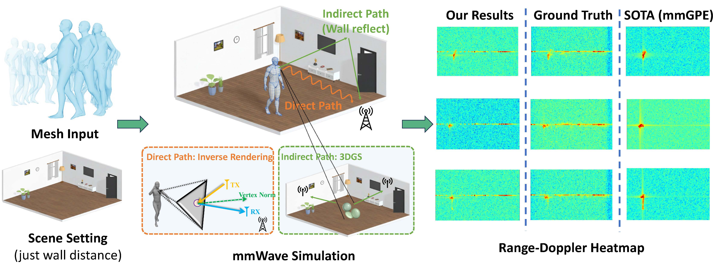
</p>

<p align="center">
  <sub>
    <b>HybridSim</b> synthesizes realistic mmWave signals from dynamic human meshes and indoor scenes by decoupling propagation into direct inverse-rendering paths and indirect 3DGS-based paths.
  </sub>
</p>

## Abstract

<p align="justify">
High-fidelity simulation of mmWave radar signals for dynamic human motion is valuable for developing radar-based human sensing models; yet collecting accurately labeled measurements for a specific deployment site remains expensive. We present <b>HybridSim</b>, a physics-learning hybrid simulator that synthesizes mmWave radar signals from dynamic human meshes under a fixed indoor room configuration, explicitly decoupling propagation into two components.
</p>

<p align="justify">
To parameterize the human subject, we use a TriPlane representation to extract human features and a Graph Convolutional Network to stabilize optimization and mitigate gradient instability. The direct signal path is modeled via an inverse-rendering formulation with a microfacet BRDF to capture primary surface reflections. In parallel, the indirect path is approximated by combining 3D Gaussian Splatting with a virtual-receiver geometry to fit and reproduce site-specific multipath interference patterns, achieving substantially lower computational cost than explicit full ray tracing.
</p>

<p align="justify">
Experiments in a fixed-room setting show improved agreement with a physically based reference and consistent gains on downstream radar-based human sensing tasks when using HybridSim for site-specific data augmentation.
</p>

## mmMesh Motion and Time-Doppler Gallery

### Haoyu

<table>
  <tr>
    <td width="50%">
      <b>A1</b>
      <table>
        <tr>
          <td><sub>Motion</sub><br><a href="assets/gallery/haoyu/haoyu_a1.mp4">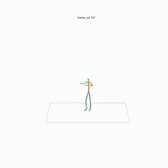</a></td>
          <td><sub>GT</sub><br>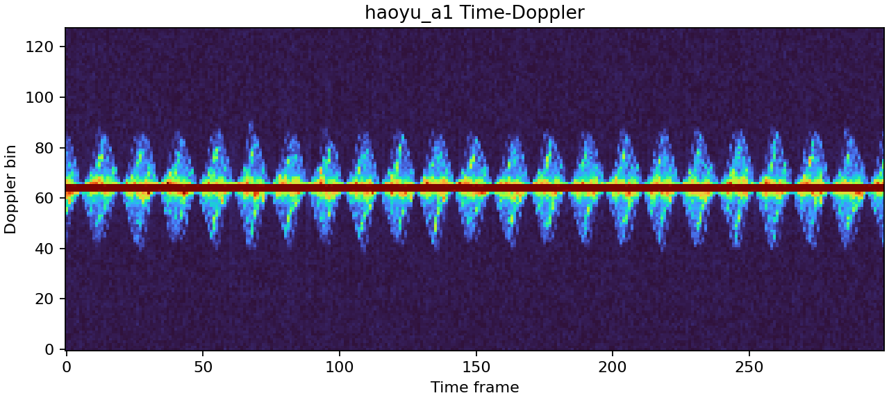<br><sub>Sim</sub><br>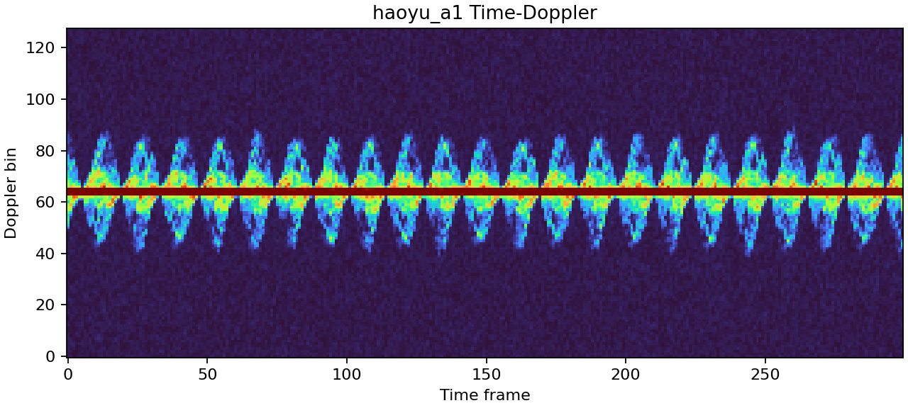</td>
        </tr>
      </table>
    </td>
    <td width="50%">
      <b>A2</b>
      <table>
        <tr>
          <td><sub>Motion</sub><br><a href="assets/gallery/haoyu/haoyu_a2.mp4">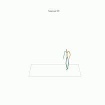</a></td>
          <td><sub>GT</sub><br>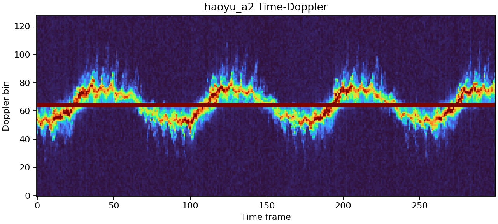<br><sub>Sim</sub><br>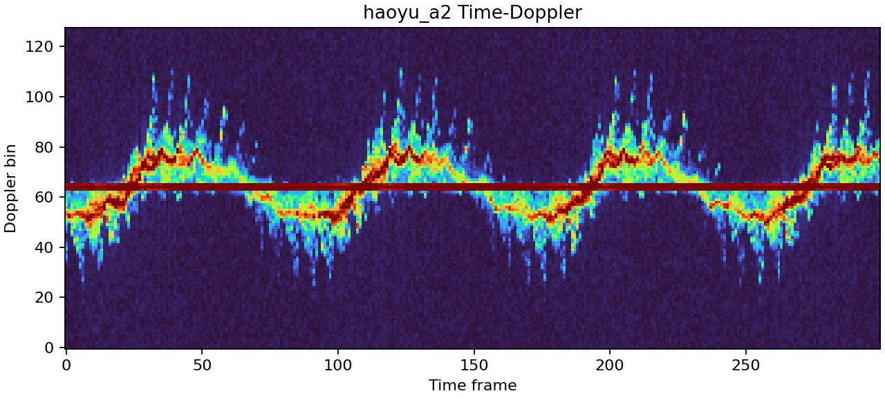</td>
        </tr>
      </table>
    </td>
  </tr>
  <tr>
    <td width="50%">
      <b>A3</b>
      <table>
        <tr>
          <td><sub>Motion</sub><br><a href="assets/gallery/haoyu/haoyu_a3.mp4">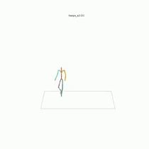</a></td>
          <td><sub>GT</sub><br>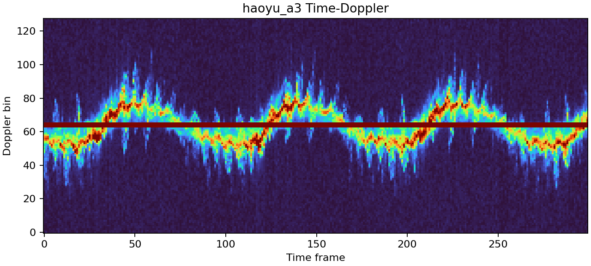<br><sub>Sim</sub><br>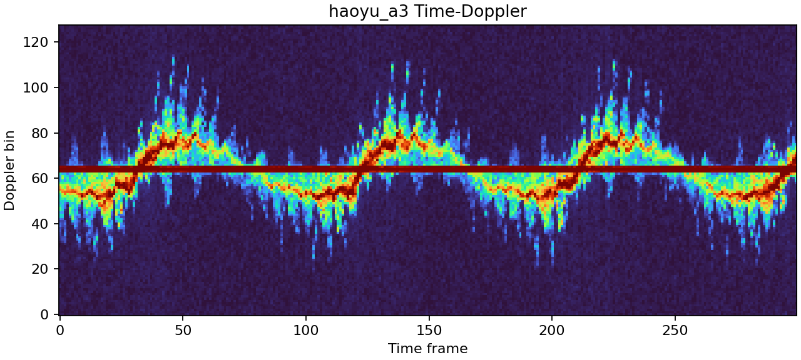</td>
        </tr>
      </table>
    </td>
    <td width="50%">
      <b>A4</b>
      <table>
        <tr>
          <td><sub>Motion</sub><br><a href="assets/gallery/haoyu/haoyu_a4.mp4">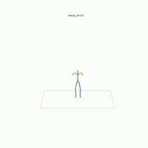</a></td>
          <td><sub>GT</sub><br>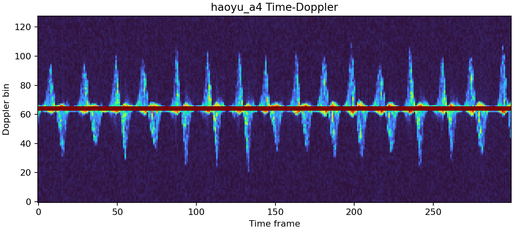<br><sub>Sim</sub><br>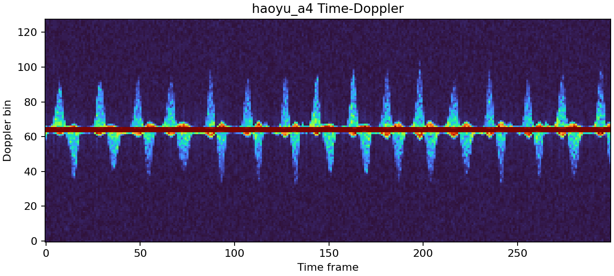</td>
        </tr>
      </table>
    </td>
  </tr>
  <tr>
    <td width="50%">
      <b>A5</b>
      <table>
        <tr>
          <td><sub>Motion</sub><br><a href="assets/gallery/haoyu/haoyu_a5.mp4">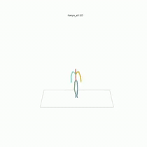</a></td>
          <td><sub>GT</sub><br>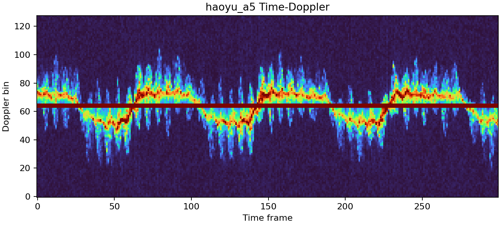<br><sub>Sim</sub><br>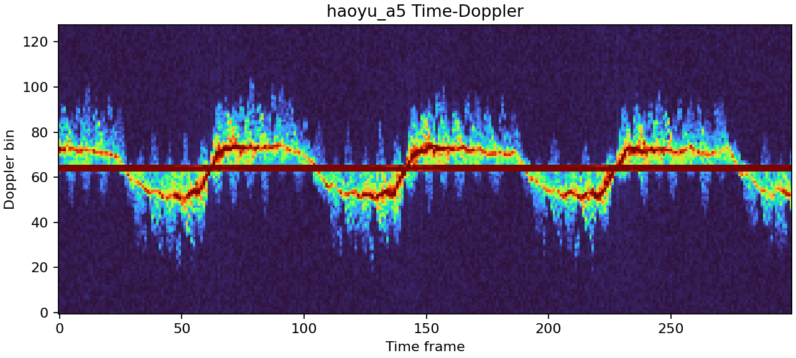</td>
        </tr>
      </table>
    </td>
    <td width="50%">
      <b>A6</b>
      <table>
        <tr>
          <td><sub>Motion</sub><br><a href="assets/gallery/haoyu/haoyu_a6.mp4">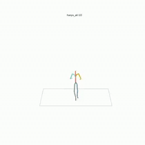</a></td>
          <td><sub>GT</sub><br>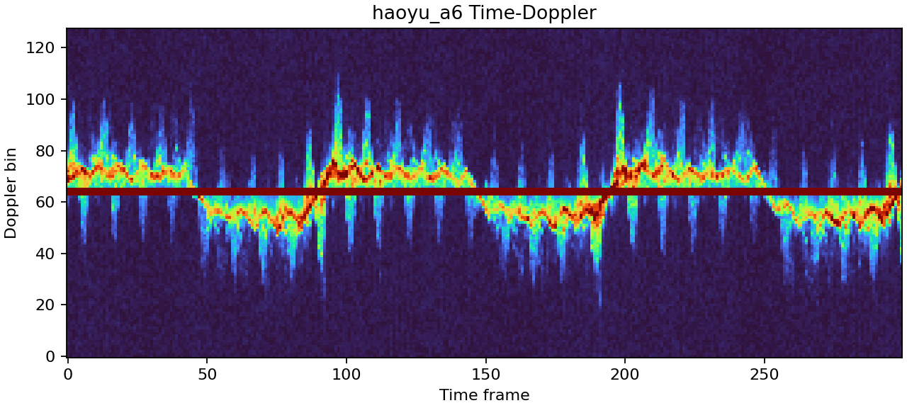<br><sub>Sim</sub><br>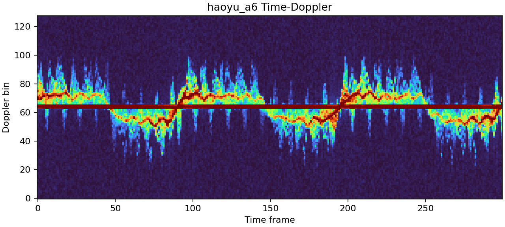</td>
        </tr>
      </table>
    </td>
  </tr>
  <tr>
    <td width="50%">
      <b>A7</b>
      <table>
        <tr>
          <td><sub>Motion</sub><br><a href="assets/gallery/haoyu/haoyu_a7.mp4">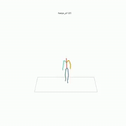</a></td>
          <td><sub>GT</sub><br>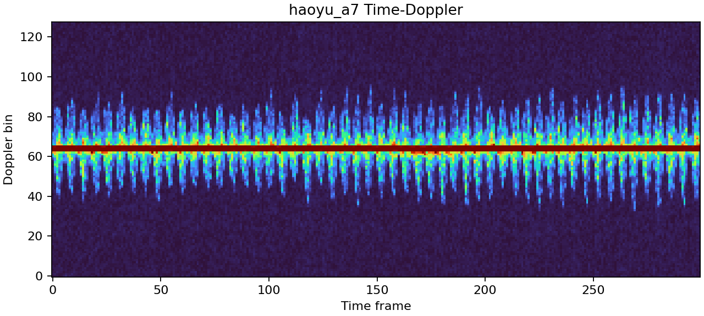<br><sub>Sim</sub><br>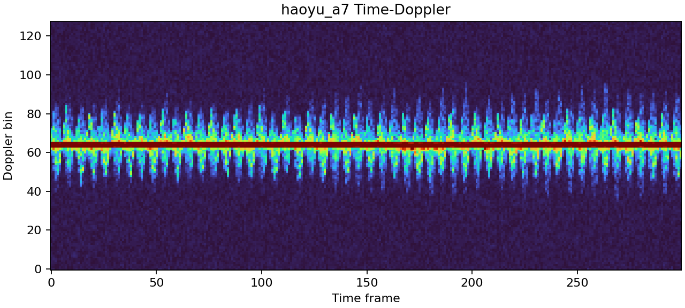</td>
        </tr>
      </table>
    </td>
    <td width="50%">
      <b>A8</b>
      <table>
        <tr>
          <td><sub>Motion</sub><br><a href="assets/gallery/haoyu/haoyu_a8.mp4">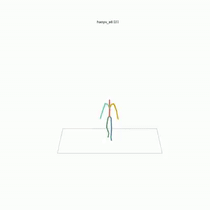</a></td>
          <td><sub>GT</sub><br>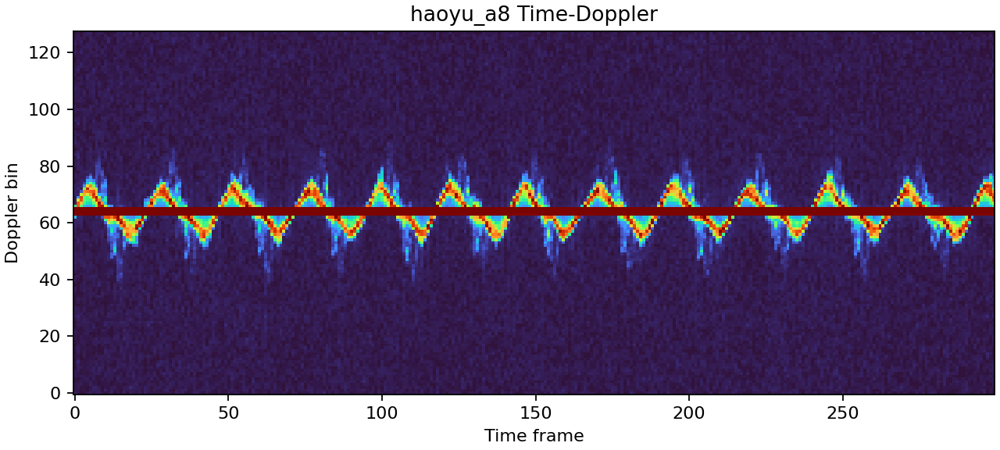<br><sub>Sim</sub><br>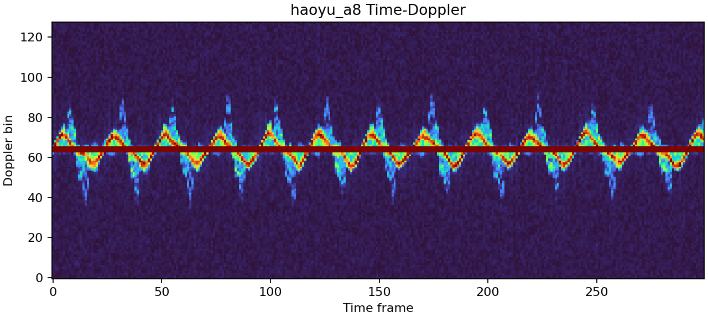</td>
        </tr>
      </table>
    </td>
  </tr>
</table>

## Code

Coming soon.

## Citation

If you find this repository useful, please cite the corresponding paper when it is available.

```bibtex
@misc{xiong2026hybridsim,
  title  = {HybridSim: A Physics--Learning Hybrid Digital Twin for mmWave Human Sensing},
  author = {Xiong, Weitao and Liu, Tianyu and Li, Peng and Chua, Kok Chung and Khim, Toa Chean and Wang, Pu and Xue, Hongfei},
  year   = {2026}
}
```

## Acknowledgements

This project builds on SMPL/SMPL-X, 3D Gaussian Splatting, PyTorch, Kornia, mmGPE, and mmAP.
